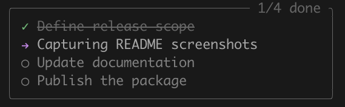
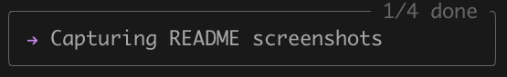

# @tallshort/pi-todo-write-overlay

A persistent, passive `todo_write` overlay for [pi](https://github.com/badlogic/pi-mono). It renders session tasks in the top-right corner without taking keyboard focus.

> Forked from [Jonghakseo/pi-extension: packages/todo-write-overlay](https://github.com/Jonghakseo/pi-extension/tree/main/packages/todo-write-overlay). This fork adds zero-margin placement, persistent full/compact display modes, a configurable title, and refined task colours.





## Installation

```bash
pi install npm:@tallshort/pi-todo-write-overlay
```

Do not install this extension together with another extension that registers the `todo_write` tool.

## Features

- Registers the `todo_write` tool with session-scoped state restoration.
- Shows a non-capturing overlay anchored at the top-right corner with no margin.
- Supports persistent `full` and `compact` display modes.
- Toggles display mode with `Ctrl+Shift+T`.
- Supports `/todo-overlay full`, `/todo-overlay compact`, `/todo-overlay hide`, and `/todo-overlay hide-once`.
- Uses an accent-coloured icon with normal output text for in-progress tasks.
- Uses muted styling for pending tasks.
- Shows a compact progress counter such as `1/4 done`.

## Display modes

### Full

Shows the title (when configured), progress count, and every task inside a framed overlay.

### Compact

Keeps the frame and progress count, but displays one task row only:

1. The in-progress task, if present.
2. Otherwise, the first pending task.
3. Otherwise, `✓ all done`.

## Configuration

Display settings are persisted in `~/.pi/agent/todo-write-overlay.json`.

```json
{
  "displayMode": "full",
  "title": "TODO"
}
```

- On first startup, the extension creates this file with the default title `TODO`.
- If an existing settings file omits `title`, or sets it to an empty string, the full-mode frame has no title.
- `full` and `compact` persist the selected display mode; `hide` keeps the overlay hidden for the current session; `hide-once` restores it when `todo_write` next changes the task list.

## Commands and shortcut

```text
/todo-overlay full
/todo-overlay compact
/todo-overlay hide
/todo-overlay hide-once
```

Use `Ctrl+Shift+T` to toggle between `full` and `compact`.

## Development

```bash
npm install
npm test
npm run typecheck
npm run build
```
`build` is a type-check because pi loads the TypeScript extension source directly.

## Contributing

Read [CONTRIBUTING.md](./CONTRIBUTING.md) for setup, change, and verification guidance. Repository-specific instructions for coding agents are in [AGENTS.md](./AGENTS.md); planned work is tracked in [TODO.md](./TODO.md).
## License and attribution

MIT. Copyright (c) 2026 Jonghakseo and tallshort.
